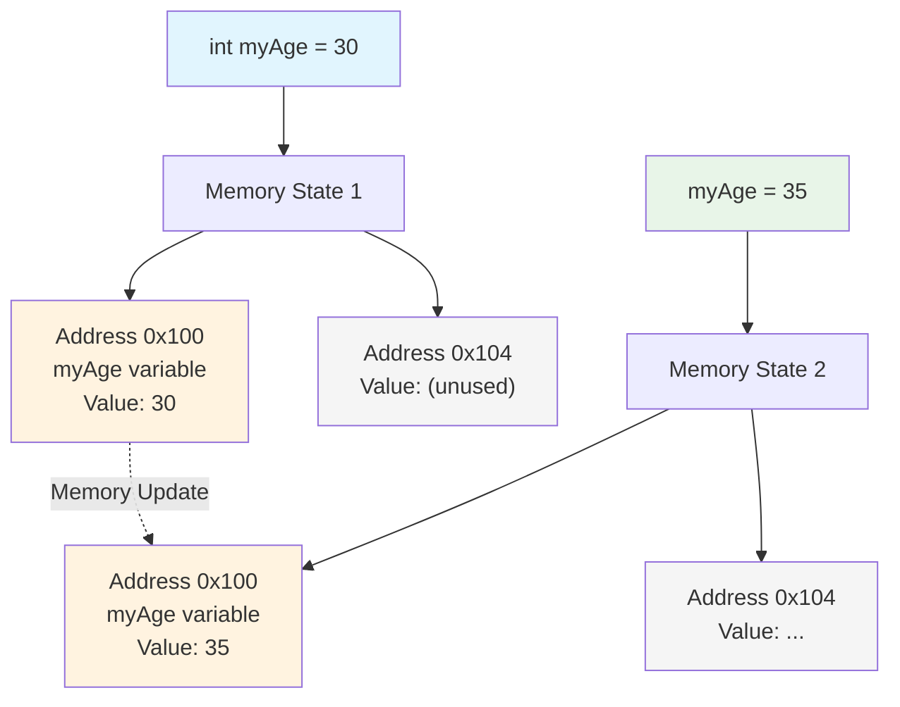
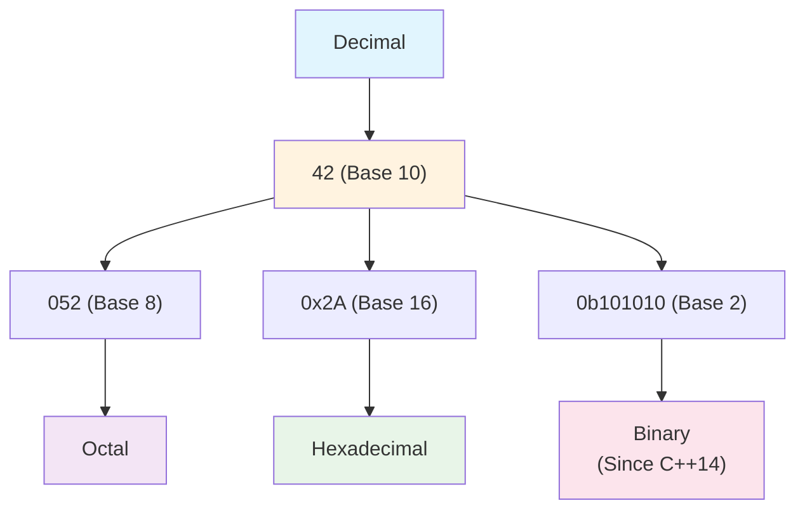

# C++ Variables
*Table of Contents:*
- [[#🎯 What & Why|🎯 What & Why]]
- [[#⚡ Core Syntax|⚡ Core Syntax]]
- [[#🔧 Essential Methods|🔧 Essential Methods]]
- [[#✏️ pictorial representation Visual Diagrams|✏️ pictorial representation Visual Diagrams]]
- [[#⚖️ Quick Pros/Cons|⚖️ Quick Pros/Cons]]
- [[#🐛 Common Issues|🐛 Common Issues]]
- [[#💡 Key Tips|💡 Key Tips]]

## 🎯 What & Why
**Purpose**:
	A variable in C++ is a name given to a storage location in the computer's memory. It is the most fundamental unit of data storage in a program. The value stored in a variable can be accessed or changed during program execution.
	Variables are used to store data, such as numbers, characters, or text, so that it can be used, retrieved, and manipulated throughout a 
**Use When:** 
- Storing user input (e.g., a user's age). 
- Holding the result of a calculation (e.g., the sum of two numbers).
- Controlling a loop (e.g., a counter variable in a `for` loop).
- Storing a value that represents a state (e.g., a `bool` variable to check if a condition is true or false).
**Analogy:**
Think of a variable as a labeled box. The label on the box is the variable's name, and the contents inside the box are the variable's value. The type of box (e.g., a shoebox, a filing box) determines what kind of contents it can hold, just as a data type in C++ determines the type of data a variable can store.

## ⚡ Core Syntax
- **Declaration:** Before a variable can be used, it must be declared. This tells the compiler the variable's data type and name, allowing it to allocate the appropriate memory space.
    ```
    data_type variable_name;
    ```
    
- **Initialization:** Initialization is the process of giving a variable its first value. It is a best practice to initialize variables upon declaration to avoid using a garbage value.
    ```c++
    // Declaration and Initialization
    data_type variable_name = value;
    
    // Example
    int myAge = 30;
    double pi = 3.14159;
    char grade = 'A';
    ```
    
- **Assignment:** After a variable has been declared and initialized, you can change its value using the assignment operator (`\=\`).
    ```c++
    int myNumber = 10;
    myNumber = 25; // The value of myNumber is now 25
    ```
    
- **Naming Conventions:**
    - Variable names can contain letters (`a-z`, `A-Z`), digits (`0-9`), and underscores (`_`).
    - They must begin with a letter or an underscore.
    - They are case-sensitive (e.g., `myVar` is different from `myvar`).
    - They cannot be a reserved C++ keyword (e.g., `int`, `double`, `class`).
    - Use descriptive names (e.g., `numberOfStudents` instead of `n`). A common style is `camelCase` (e.g., `totalCost`) or `snake_case` (e.g., `total_cost`).

## 🔧 Essential Methods
- **Primitive Data Types:** These are the most basic types.
    - `int`: Stores whole numbers (e.g., `10`, `-500`).
    - `double`: Stores large decimal numbers with double precision (e.g., `3.14159`).
    - `float`: Stores smaller decimal numbers with single precision (e.g., `3.14f`). The `f` suffix is used to denote a float literal.
    - `char`: Stores a single character, enclosed in single quotes (e.g., `'a'`, `'5'`). Its value is its ASCII code.
    - `bool`: Stores a boolean value, either `true` (represented as `1`) or `false` (represented as `0`).
        
- **Modifiers:**
    - `const`: Declares a constant variable whose value cannot be changed after initialization.
    - `long`/`short`, `signed`/`unsigned`: Used to modify the size and range of integer types. For example, `long long` for very large integers.
        
- **Type Conversion (Casting):** The process of converting one data type to another.

## ✏️ pictorial representation Visual Diagrams


**Explanation:** The diagram shows the conceptual representation of a variable in memory. `myAge` is the variable name, acting as a label for a specific memory address. When the variable is initialized, a value is placed in that memory location. When the value is changed, the new value is stored in the same memory location, overwriting the old one.

## ⚖️ Quick Pros/Cons
*Advantages:*
- **Data Manipulation:** Variables are essential for storing and manipulating data within a program.
- **Readability:** Using descriptive variable names makes code easier to read and understand.
- **Flexibility:** The ability to change a variable's value at runtime makes programs dynamic and responsive.

*Disadvantages:*
- **Memory Usage:** Each variable uses memory. Declaring variables with an overly large scope or those that are not used can lead to inefficient memory allocation.
- **Maintainability:** Excessive use of global variables can make code harder to understand and maintain, as their values can be modified from anywhere in the program.
- **Type Safety:** C++ is a strongly-typed language, but implicit conversions can sometimes lead to unexpected results. Modern C++ features like `auto` and `const` can mitigate some of these issues.


## 🐛 Common Issues
**Problem:** Using an uninitialized variable.
    - **Error:** The compiler will often issue a warning, and the program will use a "garbage" value from memory, leading to unpredictable behavior.
    - **Solution:** Always initialize your variables. The best practice is to initialize them at the point of declaration
```c++
    // Bad
    int myValue;
    std::cout << myValue; // myValue is uninitialized.
    
    // Good
    int myValue = 0;
    std::cout << myValue;
```
    
- **Problem:** Confusing variable names or using a keyword as a variable name.    
    - **Error:** This can cause compile-time errors or make your code difficult to read.
    - **Solution:** Follow standard naming conventions and avoid using reserved keywords.
        
- **Problem:** Scope issues with local and global variables.
    - **Error:** A local variable with the same name as a global variable will "hide" the global variable within its scope, potentially leading to confusion.
    - **Solution:** Use distinct, descriptive names for local and global variables. Minimize the use of global variables.


## 💡 Key Tips
- **Minimize Scope:** Declare variables in the smallest possible scope. This improves readability and prevents unnecessary memory allocation.
- **Initialize on Declaration:** If possible, always initialize a variable when you declare it rather than assigning a value later. This leads to more efficient code.
- **Use `const` for unchanging values:** Use the `const` keyword for variables whose values should not be modified. This helps the compiler and other developers know that the value is fixed and can prevent accidental changes.
- **"Almost Always Auto" (AAA):** For modern C++, the "Almost Always Auto" principle is a common best practice where you use the `auto` keyword for type deduction. This can make code cleaner and more readable.

```C++
// Less readable
std::vector<std::string> names = {"Alice", "Bob"};

// More readable with auto
auto names = std::vector<std::string>{"Alice", "Bob"};
```


# C++ Literals
*Table of Contents:*
- [[#🎯 What & Why|🎯 What & Why]]
- [[#⚡ Core Syntax|⚡ Core Syntax]]
- [[#🔧 Essential Methods|🔧 Essential Methods]]
- [[#✏️ pictorial representation Visual Diagrams|✏️ pictorial representation Visual Diagrams]]
- [[#⚖️ Quick Pros/Cons|⚖️ Quick Pros/Cons]]
- [[#🐛 Common Issues|🐛 Common Issues]]
- [[#💡 Key Tips|💡 Key Tips]]
	- [[#💡 Key Tips#Problems|Problems]]
## 🎯 What & Why
- In C++, a literal is a fixed value that is inserted directly into the source code.

- They are also known as literal constants because their values are fixed and cannot be changed during program execution, unlike variables.
 
- Every literal has a value and a data type, and its value must be within the representable range for that type.

**Purpose & Use Cases**
- Literals are used to represent values directly in code, such as `10` (an integer), `3.14` (a floating-point number), or `"Hello"` (a string).
    
- They are fundamental to writing any program, as they provide the raw data that the program operates on.
    
- Literals can be used as operands in expressions, such as `2 * 3 + 4`.
    
- User-defined literals (UDLs) introduced in C++11 allow for creating new, custom literal types to improve readability and type safety, for example, `42.0_km` instead of a raw number.

**Analogy:**
Think of literals as the building blocks of a sentence. A literal like `"Hello"` is a specific, unchanging word, while a variable is like a blank space that you can fill with different words. The literal itself is the value, and it doesn't change unless you rewrite the source code and recompile it.

## ⚡ Core Syntax
- **Integer Literals**
    - Represent whole numbers. They can be in different bases:
        
        - **Decimal (Base 10):** No prefix. E.g., `42`.
            
        - **Octal (Base 8):** Prefix with `0`. E.g., `052` (which is 42 in decimal).
            
        - **Hexadecimal (Base 16):** Prefix with `0x` or `0X`. E.g., `0x2A` (which is 42 in decimal).
            
        - **Binary (Base 2):** Prefix with `0b` or `0B` (since C++14). E.g., `0b101010` (which is 42 in decimal).
            
    - **Suffixes:** Suffixes can specify the type of the literal:
        - `u` or `U`: `unsigned int`, `unsigned long int`, `unsigned long long int`.
            
        - `l` or `L`: `long int`, `long long int`.
            
        - `ll` or `LL`: `long long int`.
            
        - The combination of `u` and `l` is also possible, e.g., `42UL`.
            
- **Floating-Point Literals**
    - Represent numbers with a fractional part. They can be in decimal or exponential form.
        
    - **Syntax:**
        - `3.14159`
            
        - `314159E-5L` (exponential form)
            
    - **Suffixes:** Change the default type `double`:
        - `f` or `F`: `float`
            
        - `l` or `L`: `long double`
            
- **Character Literals**
    - Represent a single character and are enclosed in single quotes `' '`.
        
    - The type of a narrow character literal is `char`.
        
    - **Prefixes:**
        - `L`: Wide character literal, type `wchar_t`. E.g., `L'x'`.
            
        - `u`: UTF-16 character literal, type `char16_t`.
            
        - `U`: UTF-32 character literal, type `char32_t`.
            
        - `u8`: UTF-8 character literal, type `char8_t` (since C++20).
            
    - **Escape Sequences:**
        - `\n`: Newline
            
        - `\t`: Horizontal tab
            
        - `\'`: Single quote
            
        - `\"`: Double quote
            
        - `\\`: Backslash
            
        - `\ooo`: Octal number
            
        - `\xhh`: Hexadecimal number
            
- **String Literals**
    - A sequence of characters enclosed in double quotes `" "`.
        
    - The type of a narrow string literal is `const char[]` and has static storage duration.
        
    - **Prefixes:**
        - `L`: Wide string literal, type `const wchar_t[]`.
            
        - `u8`: UTF-8 string literal, type `const char[]` (until C++20), `const char8_t[]` (since C++20).
            
        - `u`: UTF-16 string literal, type `const char16_t[]`.
            
        - `U`: UTF-32 string literal, type `const char32_t[]`.
            
- **Boolean Literals**
    - There are only two boolean literals: `true` and `false`.
        
- **Pointer Literal**
    - `nullptr` (since C++11) represents a null pointer. It is the preferred way to specify a zero-initialized pointer over `NULL`.

## 🔧 Essential Methods
- **User-Defined Literals (UDLs):** C++11 introduced the ability to define your own literals.
    - This is done by defining an `operator "" _suffix` at a namespace scope.
        
    - They are a powerful feature for creating a more expressive and type-safe API.
        
    - **Syntax:**
        ```c++
        // User-defined literal for kilometers
        long double operator"" _km(long double val) {
            return val;
        }
        
        // User-defined literal for a std::string
        std::string operator"" _s(const char* str, size_t len) {
            return std::string(str, len);
        }
        ```
        
    - **Usage:**
        ```c++
        auto distance = 100.0_km; // The compiler calls operator""_km(100.0)
        std::string my_string = "hello"_s; // Calls operator""_s("hello", 5)
        ```
        
- **Cooked vs. Raw Literals:**
    - **Cooked Literals:** The compiler interprets the literal value and passes a converted type to the UDL operator. This is what you see in the examples above with `long double` or `unsigned long long int`.
        
    - **Raw Literals:** For string literals, the UDL operator receives a raw character array and its size, allowing for more fine-grained control


## ✏️ pictorial representation Visual Diagrams



**Explanation:** The decimal value `42` can be written in C++ as a decimal literal (`42`), an octal literal (`052`), a hexadecimal literal (`0x2A`), or a binary literal (`0b101010`). The compiler interprets all these forms as the same integer value.

## ⚖️ Quick Pros/Cons
*Advantages:*
- **Readability:** Literals make code more explicit and easier to understand, as the value is right there in the code.
    
- **Performance:** Literals are known at compile time, leading to potential optimizations. User-defined literals with `constexpr` can also shift calculations to compile time, resulting in faster execution.
    
- **Type Safety:** User-defined literals can enforce strong typing. For example, a `Distance` class with `_km` and `_mi` literals prevents mixing units accidentally.
    
- **Immutability:** Their fixed nature guarantees that their values will not be altered at runtime, which is a key part of program correctness and safety.

*Disadvantages:*
- **Magic Numbers:** Using raw, unexplained numeric literals in code (e.g., `if (x > 365)`) is often a bad practice known as using "magic numbers". It makes the code hard to read and maintain. This is why it's recommended to use named constants instead, e.g., `const int DAYS_IN_YEAR = 365;`.
    
- **Limited Customization (Built-in Literals):** You cannot change the behavior or type of built-in literals like `42` or `"Hello"`. Their interpretation is fixed by the C++ standard.


## 🐛 Common Issues
- **Incorrect Base/Digit:** A common error is using an invalid digit for a specific base, such as `078` for an octal literal, since 8 is not a valid octal digit.
    
- **String Literal Modification:** String literals are stored in read-only memory. Attempting to modify a string literal, for example, by assigning it to a non-`const char*` and then changing a character, will result in undefined behavior and can cause a crash.
    
    - **Incorrect:**       
        ```c++
        char* str = "hello";
        str[0] = 'H'; // Undefined behavior
        ```
        
    - **Correct:**
        ```c++
        const char* str = "hello"; // Read-only pointer
        char str_array[] = "hello";
        str_array[0] = 'H'; // This is a modifiable array, not a literal
        ```
        
- **Confusing `const int` with a Literal:** A variable declared as `const int x = 42;` is not a literal. `42` is the literal that initializes the `const` variable `x`. The variable `x` itself is a constant variable, not a literal, although its value is fixed.

## 💡 Key Tips
- **Use Named Constants for Readability:** Avoid "magic numbers" by using `constexpr` or `const` variables with meaningful names for literals that are used repeatedly or whose meaning is not immediately obvious. This makes code more maintainable and easier to understand.
    
- **Use Suffixes for Clarity:** Use suffixes like `U`, `L`, or `LL` to explicitly specify the type of an integer literal, which helps prevent potential overflow issues and makes the code's intent clearer.
    
- **Prefer `nullptr`:** Since C++11, always use `nullptr` for null pointers instead of `0` or the `NULL` macro. This improves type safety and prevents potential ambiguity.
    
- **Use Digit Separators:** For large numeric literals, use the single quote (`'`) as a digit separator (since C++14) to improve readability. For example, `1'000'000` is easier to read than `1000000`.

### Problems
- **Basic**
    1. Declare and initialize an integer variable `age` with a decimal literal representing your age.
        
    2. Write a program that prints a string literal "Hello, C++!" to the console.
        
    3. Declare a `char` variable and initialize it with a character literal for the letter 'X'.
        
- **Intermediate**
    1. Declare a `long long` variable and initialize it with a hexadecimal literal representing the maximum value for a 64-bit unsigned integer (`0xFFFFFFFFFFFFFFFF`).
        
    2. Write a program that uses an escape sequence to print the following output:
        ```
        "This is a quote."
        ```
        
        And:
        ```
        A\\B
        ```
        
    3. Explain the difference in storage and mutability between `const char* str = "literal";` and `char str[] = "literal";`. Write code that attempts to modify both to demonstrate the difference.
        
- **Advanced**
    1. Create a user-defined literal for a custom type `Weight` that can take a `_kg` suffix (for kilograms) and a `_lbs` suffix (for pounds). The constructor should store the weight in kilograms internally. Write a program that uses these literals and prints the total weight in pounds.
        
    2. Using the `std::string` user-defined literal `_s` (from namespace `std::literals::string_literals`), concatenate two string literals to form a single `std::string` object.
        
    3. Research and explain the concept of a multi-character literal in C++. What is its type and value, and why is it generally not used in modern C++ programming?


# C++ Constants
*Table of Contents:*
- [[#🎯 What & Why|🎯 What & Why]]
- [[#⚡ Core Syntax|⚡ Core Syntax]]
- [[#🔧 Essential Methods|🔧 Essential Methods]]
- [[#✏️ pictorial representation Visual Diagrams|✏️ pictorial representation Visual Diagrams]]
- [[#⚖️ Quick Pros/Cons|⚖️ Quick Pros/Cons]]
- [[#🐛 Common Issues|🐛 Common Issues]]
- [[#💡 Key Tips|💡 Key Tips]]
- [[#❓Problems|❓Problems]]
## 🎯 What & Why
- In C++, a constant is a value that cannot be changed after its initial assignment.
    
- Constants are primarily declared using the `const` and `constexpr` keywords. `const` is for immutability, while `constexpr` is for immutability that is guaranteed to be evaluated at compile time.
    
- The use of constants is a core part of "const-correctness," a C++ programming practice that involves using the `const` keyword to enforce that data is not modified where it shouldn't be, which helps prevent accidental changes and improves code clarity.


**Purpose& Use When:**
- **Enforce Immutability:** The primary purpose is to ensure that a value remains fixed throughout its lifetime, which prevents bugs caused by accidental modifications.
    
- **Self-Documenting Code:** Using `const` makes the intent of the code clear. When another developer sees a `const` variable, they know its value is not meant to be changed.
    
- **Enable Compiler Optimizations:** When the compiler knows a value is constant, it can perform various optimizations, such as inlining the value directly into the code. The `constexpr` keyword takes this a step further by guaranteeing compile-time evaluation.
    
- **Defining Fixed Values:** Constants are perfect for defining fixed values like mathematical constants (`PI`), configuration settings (`MAX_USERS`), or array sizes.


**Analogy:**
Think of a `const` variable as a pre-printed sign on a wall. You can read the sign, and everyone knows what it says, but you cannot change the words on the sign without replacing it entirely. A regular variable, on the other hand, is a blank whiteboard where you can erase and write new information whenever you want.


## ⚡ Core Syntax
**`const` Keyword for Variables**

- `const` can be placed **before or after the type name**, although placing it **before is more common**.
- A `const` variable **must be initialized** at the time of its declaration.

**Example**
```cpp
const int MAX_ATTEMPTS = 3;
// int const MAX_ATTEMPTS = 3; // Equivalent
```


**`const` with Pointers**

The **position of `const`** with pointers is **crucial** and changes its meaning:

- `const int* ptr;`  
  → A **pointer to a const value**.  
  - The value pointed to by `ptr` **cannot** be changed through `ptr`.
  - But `ptr` **can be changed** to point to another location.

- `int* const ptr;`  
  → A **const pointer to a non-const value**.  
  - The pointer `ptr` **cannot** be changed.
  - But the value it points to **can** be modified.

- `const int* const ptr;`  
  → A **const pointer to a const value**.  
  - Neither the pointer nor the value it points to **can be changed**.


**`const` with Member Functions**

- Placing `const` **after a member function’s parameter list** indicates the function **does not modify** the object's state.
- A `const` member function:
  - Can **only call other `const` member functions**
  - **Cannot change non-mutable member variables**

**Example**
```cpp
class User {
private:
    std::string name;
public:
    std::string getName() const { // `const` member function
        return name;
    }

    void setName(const std::string& n) {
        name = n;
    }
};
```


**`constexpr` Keyword**

- Introduced in **C++11**
- Guarantees that an expression or function will be **evaluated at compile time**
- A `constexpr` variable is **implicitly `const`**
- Can be used on:
  - Variables
  - Functions
  - Constructors

**Example**
```cpp
constexpr int MAX_SIZE = 100; // Compile-time constant

constexpr int get_area(int length, int width) {
    return length * width;
}

int main() {
    constexpr int area = get_area(10, 5); // Evaluated at compile time
}
```

## 🔧 Essential Methods
- **`const` Variables:** The most common approach is to use `const` for simple variables whose values are known at runtime but should not be changed. This is a fundamental part of writing safe C++ code.
    
- **`const` References and Pointers:** Using `const` with function parameters, especially for references (`const T&`) and pointers (`const T*`), is a best practice. It prevents the function from accidentally modifying the argument and allows the function to accept both `const` and non-`const` objects.
    
- **`const` Member Functions:** Declaring "getter" or "accessor" member functions as `const` is essential for proper class design. It allows these functions to be called on `const` objects and clearly signals that they are read-only operations.
    
- **`constexpr` for Compile-Time Evaluation:** Use `constexpr` for values and functions that can and should be computed at compile time. This can lead to performance benefits by shifting work from runtime to compile time. `constexpr` is often used for:
    
    - Array sizes (`std::array<int, N>`).
        
    - Complex calculations that are constant (e.g., a lookup table).
        
    - Custom types that can be created at compile time.
## ✏️ pictorial representation Visual Diagrams
```c++
int value = 42;
  int another_value = 100;
  
  // Pointer to a constant int
  const int* p1 = &value;
  
  //   p1
  //   │
  //   ▼      (Points to a `const` int)
  // [value] <---- Cannot change this value through p1
  
  // Legal: p1 can point to a new value
  p1 = &another_value;
  
  // Illegal: cannot change value through p1
  // *p1 = 50;  // COMPILE-TIME ERROR
  
  // ----------------------------------------------------
  
  // Constant pointer to a non-const int
  int* const p2 = &value;
  
  //   p2 (Constant pointer)
  //   │
  //   ▼
  // [value] <---- Can change this value through p2
  
  // Legal: can change value through p2
  *p2 = 50;
  
  // Illegal: p2 cannot point to a new value
  // p2 = &another_value; // COMPILE-TIME ERROR
```

**Explanation:** The position of the `const` keyword matters. With `const int* p1`, the pointer can be reassigned, but the value it points to cannot be changed. With `int* const p2`, the pointer is fixed to one address, but the value at that address can be modified.


## ⚖️ Quick Pros/Cons
**Advantages of `const`**
- **Enforced Immutability**  
  Guarantees a value cannot be changed after initialization, preventing accidental modification.

- **Improved Readability**  
  Communicates intent clearly to other developers, effectively self-documenting the code.

- **Compiler Optimizations**  
  Allows inlining and other optimizations, potentially improving performance.

- **Const-Correctness**  
  Supports const objects and const member functions, making APIs safer and more robust by enforcing read-only contracts.


**Disadvantages of `const`**
- **Magic Numbers**  
  Using unnamed constants (e.g., `if (x == 100)`) reduces readability. Prefer named `const` variables.

- **Initialization Requirement**  
  Must be initialized at declaration, which can be limiting if the value is determined later.


**Advantages of `constexpr`**
- **Compile-Time Performance**  
  Shifts work from runtime to compile time, greatly improving performance for complex computations.

- **Meta-Programming**  
  Enables compile-time logic, useful for template meta-programming.

- **Type Safety and Readability**  
  Ensures values are known at compile time, improving clarity and safety.

- **Stronger Guarantees**  
  A `constexpr` is implicitly `const`, with added guarantee of compile-time evaluation when possible.


**Disadvantages of `constexpr`**
- **Stricter Constraints**  
  Cannot use dynamic memory, virtual functions, or exceptions, limiting applicability.

- **Not Always Compile-Time Evaluated**  
  If passed runtime values, the function evaluates at runtime. This can lead to subtle behavioral differences.


## 🐛 Common Issues
- **`const` Pointers Misunderstanding:** A common error is confusing `const int* p` (pointer to a constant int) with `int* const p` (a constant pointer to a mutable int). The rule of thumb is to read the declaration from right to left: "p is a `const` pointer to an `int`" vs. "p is a pointer to a `const` `int`".
    
- **Modifying a `const` Object:** Attempting to modify a `const` variable or an object through a `const` pointer/reference will result in a compilation error. The only way to bypass this is with `const_cast`, which is a powerful and dangerous tool that should be used with extreme caution. Using `const_cast` to modify an object that was originally declared `const` can lead to undefined behavior.
    
- **`constexpr` Function Restrictions:** While `constexpr` functions are powerful, they have restrictions. In older C++ standards, they were very limited (e.g., only a single return statement in C++11). In modern C++ (C++14 and later), these restrictions have been relaxed, but they still cannot have static variables or use dynamic memory allocation.
    
- **Magic Numbers:** A bad practice related to constants is using un-named literal values (e.g., `if (x == 3.14)`). This makes code less readable and maintainable. The solution is to use a named `const` or `constexpr` variable for the value.


## 💡 Key Tips
- **Prefer `constexpr` over `const` for Compile-Time Constants:** If a value's initializer is a compile-time constant expression, use `constexpr`. This gives the compiler more information, leading to better optimization and clearer intent.
    
- **Use `const` for Function Parameters:** Pass complex objects by `const` reference (`const std::string&`) to avoid unnecessary copies while ensuring the original object is not modified.
    
- **Declare Member Functions `const`:** As a rule of thumb, if a member function does not need to modify the object's state, declare it `const`. This allows the function to be called on `const` objects and is a form of self-documentation.
    
- **Use `const` on the Left for Readability:** While `const int*` and `int const*` are equivalent, placing `const` on the left is a widely accepted convention that reads more naturally as "a constant `int` pointer".
    
- **`constinit` for Static Initialization (C++20):** For static and thread-local variables, C++20 introduced `constinit`. Unlike `constexpr`, `constinit` only guarantees compile-time initialization, but the variable itself can be modified at runtime. This can be useful for performance-critical static objects that don't need to be `const` but require guaranteed zero-overhead initialization.


## ❓Problems
- **Basic**
    1. Declare a `const double` variable named `PI` and initialize it with `3.14159`. Write a program that attempts to change its value and observe the compilation error.
        
    2. Write a simple class `Circle` with a `const` member variable `radius`. Initialize it using the constructor's initializer list.
        
    3. Create a function `print_message` that takes a `const std::string&` as a parameter and prints it to the console. Inside the function, attempt to modify the string to see what happens.
        
- **Intermediate**
    1. Create a class `Counter` with a private `int count` and a public member function `getCount()` that is declared as `const`. Then, create a `const Counter` object and verify that you can call `getCount()` but not any non-`const` member functions.
        
    2. Write a program that uses `const` with pointers to demonstrate the difference between a `const` pointer and a pointer to a `const` variable.
        
    3. Create a `constexpr` function that calculates the factorial of a number. Then, use this function to initialize a `constexpr` variable and the size of a C-style array.
        
- **Advanced**
    1. Write a program that defines a class `Vector2D` with `constexpr` constructors and member functions. Use `constexpr` to perform vector addition and magnitude calculation at compile time.
        
    2. Explain the concept of `const` vs. `mutable` in a class context. Create a class `Logger` with a `mutable int logCount` member. Implement a `const` member function `log()` that increments `logCount` and prints a message. Explain why this is a valid use case for `mutable`.
        
    3. Explore the `const_cast` operator. Write a program that takes a `const int*` as a function parameter, then uses `const_cast` to modify the value. Explain why this is generally unsafe and can lead to undefined behavior, especially if the original variable was truly `const`.


# Back Matter

**Source**
<!-- Always keep a link to the source- --> 
- based_on::[[C++ References & CheatSheets.pdf]]
- based_on::Programmiz::C++ Variables, literals, and constants

```cardlink
url: https://www.programiz.com/cpp-programming/data-types
title: "C++ Data Types"
description: "In this tutorial, we will learn about basic data types such as int, float, char, etc. in C++ programming with the help of examples. A data type determines the type and size of an variable."
host: www.programiz.com
```


**References**
<!-- Links to pages not referenced in the content. see: [[related note]] because <reason> -->
- see:: [[CPP Index]]

**Terms**
<!-- Links to definition pages. -->
- data types
- declaration
- init


---
**Tasks**
<!-- What remains to be done with this note? --> 
- Basic concept that is easy to understand. Implement int into your project first. Test them out based on the needs of your project.


