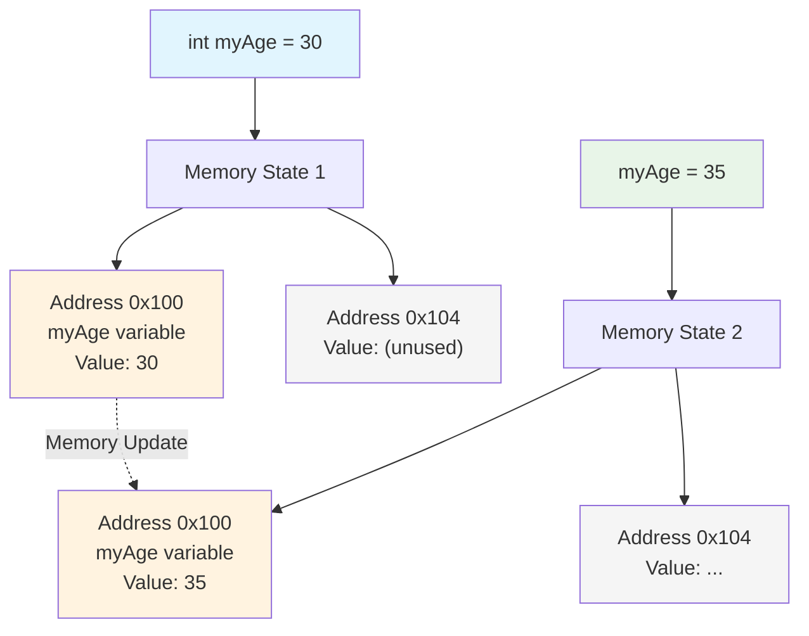

# C++ Variables
*Table of Contents:*
- [[#🎯 What & Why|🎯 What & Why]]
- [[#⚡ Core Syntax|⚡ Core Syntax]]
- [[#🔧 Essential Methods|🔧 Essential Methods]]
- [[#✏️ pictorial representation Visual Diagrams|✏️ pictorial representation Visual Diagrams]]
- [[#⚖️ Quick Pros/Cons|⚖️ Quick Pros/Cons]]
- [[#🐛 Common Issues|🐛 Common Issues]]
- [[#💡 Key Tips|💡 Key Tips]]

---
## 🎯 What & Why
**Purpose**:
	A variable in C++ is a name given to a storage location in the computer's memory. It is the most fundamental unit of data storage in a program. The value stored in a variable can be accessed or changed during program execution.
	Variables are used to store data, such as numbers, characters, or text, so that it can be used, retrieved, and manipulated throughout a 
**Use When:** 
- Storing user input (e.g., a user's age). 
- Holding the result of a calculation (e.g., the sum of two numbers).
- Controlling a loop (e.g., a counter variable in a `for` loop).
- Storing a value that represents a state (e.g., a `bool` variable to check if a condition is true or false).
**Analogy:**
Think of a variable as a labeled box. The label on the box is the variable's name, and the contents inside the box are the variable's value. The type of box (e.g., a shoebox, a filing box) determines what kind of contents it can hold, just as a data type in C++ determines the type of data a variable can store.

---

## ⚡ Core Syntax
- **Declaration:** Before a variable can be used, it must be declared. This tells the compiler the variable's data type and name, allowing it to allocate the appropriate memory space.
    ```
    data_type variable_name;
    ```
    
- **Initialization:** Initialization is the process of giving a variable its first value. It is a best practice to initialize variables upon declaration to avoid using a garbage value.
    ```c++
    // Declaration and Initialization
    data_type variable_name = value;
    
    // Example
    int myAge = 30;
    double pi = 3.14159;
    char grade = 'A';
    ```
    
- **Assignment:** After a variable has been declared and initialized, you can change its value using the assignment operator (`\=\`).
    ```c++
    int myNumber = 10;
    myNumber = 25; // The value of myNumber is now 25
    ```
    
- **Naming Conventions:**
    - Variable names can contain letters (`a-z`, `A-Z`), digits (`0-9`), and underscores (`_`).
    - They must begin with a letter or an underscore.
    - They are case-sensitive (e.g., `myVar` is different from `myvar`).
    - They cannot be a reserved C++ keyword (e.g., `int`, `double`, `class`).
    - Use descriptive names (e.g., `numberOfStudents` instead of `n`). A common style is `camelCase` (e.g., `totalCost`) or `snake_case` (e.g., `total_cost`).

---
## 🔧 Essential Methods
- **Primitive Data Types:** These are the most basic types.
    - `int`: Stores whole numbers (e.g., `10`, `-500`).
    - `double`: Stores large decimal numbers with double precision (e.g., `3.14159`).
    - `float`: Stores smaller decimal numbers with single precision (e.g., `3.14f`). The `f` suffix is used to denote a float literal.
    - `char`: Stores a single character, enclosed in single quotes (e.g., `'a'`, `'5'`). Its value is its ASCII code.
    - `bool`: Stores a boolean value, either `true` (represented as `1`) or `false` (represented as `0`).
        
- **Modifiers:**
    - `const`: Declares a constant variable whose value cannot be changed after initialization.
    - `long`/`short`, `signed`/`unsigned`: Used to modify the size and range of integer types. For example, `long long` for very large integers.
        
- **Type Conversion (Casting):** The process of converting one data type to another.


---
## ✏️ pictorial representation Visual Diagrams


**Explanation:** The diagram shows the conceptual representation of a variable in memory. `myAge` is the variable name, acting as a label for a specific memory address. When the variable is initialized, a value is placed in that memory location. When the value is changed, the new value is stored in the same memory location, overwriting the old one.


---
## ⚖️ Quick Pros/Cons
*Advantages:*
- **Data Manipulation:** Variables are essential for storing and manipulating data within a program.
- **Readability:** Using descriptive variable names makes code easier to read and understand.
- **Flexibility:** The ability to change a variable's value at runtime makes programs dynamic and responsive.

*Disadvantages:*
- **Memory Usage:** Each variable uses memory. Declaring variables with an overly large scope or those that are not used can lead to inefficient memory allocation.
- **Maintainability:** Excessive use of global variables can make code harder to understand and maintain, as their values can be modified from anywhere in the program.
- **Type Safety:** C++ is a strongly-typed language, but implicit conversions can sometimes lead to unexpected results. Modern C++ features like `auto` and `const` can mitigate some of these issues.


---

## 🐛 Common Issues
**Problem:** Using an uninitialized variable.
    - **Error:** The compiler will often issue a warning, and the program will use a "garbage" value from memory, leading to unpredictable behavior.
    - **Solution:** Always initialize your variables. The best practice is to initialize them at the point of declaration
```c++
    // Bad
    int myValue;
    std::cout << myValue; // myValue is uninitialized.
    
    // Good
    int myValue = 0;
    std::cout << myValue;
```
    
- **Problem:** Confusing variable names or using a keyword as a variable name.    
    - **Error:** This can cause compile-time errors or make your code difficult to read.
    - **Solution:** Follow standard naming conventions and avoid using reserved keywords.
        
- **Problem:** Scope issues with local and global variables.
    - **Error:** A local variable with the same name as a global variable will "hide" the global variable within its scope, potentially leading to confusion.
    - **Solution:** Use distinct, descriptive names for local and global variables. Minimize the use of global variables.


---

## 💡 Key Tips
- **Minimize Scope:** Declare variables in the smallest possible scope. This improves readability and prevents unnecessary memory allocation.
- **Initialize on Declaration:** If possible, always initialize a variable when you declare it rather than assigning a value later. This leads to more efficient code.
- **Use `const` for unchanging values:** Use the `const` keyword for variables whose values should not be modified. This helps the compiler and other developers know that the value is fixed and can prevent accidental changes.
- **"Almost Always Auto" (AAA):** For modern C++, the "Almost Always Auto" principle is a common best practice where you use the `auto` keyword for type deduction. This can make code cleaner and more readable.

```C++
// Less readable
std::vector<std::string> names = {"Alice", "Bob"};

// More readable with auto
auto names = std::vector<std::string>{"Alice", "Bob"};
```

---
# Back Matter

**Source**
<!-- Always keep a link to the source- --> 
- based_on::[[C++ References & CheatSheets.pdf]]

**References**
<!-- Links to pages not referenced in the content. see: [[related note]] because <reason> -->
- see:: [[CPP Index]]

**Terms**
<!-- Links to definition pages. -->
- data types
- declaration
- init


---
**Tasks**
<!-- What remains to be done with this note? --> 
- Basic concept that is easy to understand. Implement int into your project first. Test them out based on the needs of your project.

---
**Template Help**
<!-- Links to external help pages on GitHub. -->
- [Basic Template Structure](https://github.com/groepl/Obsidian-Templates#basic-template-structure)
- [How to Use Links](https://github.com/groepl/Obsidian-Templates#how-to-use-links)
- [How to Use Tags](https://github.com/groepl/Obsidian-Templates#how-to-use-tags)
- [How to Search Notes](https://github.com/groepl/Obsidian-Templates#how-to-search-notes)
- [Plugins Needed](https://github.com/groepl/Obsidian-Templates#obsidian-plugins-needed)
- [Find Latest Updates](https://github.com/groepl/Obsidian-Templates)


