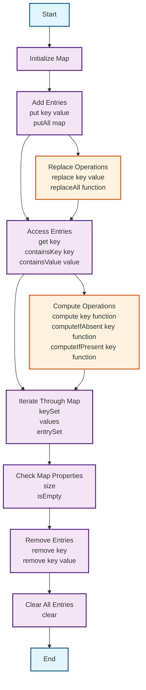

## 🎯 Concept - Java List Interface
![[J5 - Collection Structures 2025-06-27 14.07.13.excalidraw]]
—
- [[#🚀 Why & When to Use|🚀 Why & When to Use]]
	- [[#🚀 Why & When to Use#When to Consider Alternatives:|When to Consider Alternatives:]]
- [[#✍️ Syntax & Key Operations|✍️ Syntax & Key Operations]]
	- [[#✍️ Syntax & Key Operations#Example - List Element|Example - List Element]]
- [[#✏️ Diagrams|✏️ Diagrams]]
—

1. What is it _at its core_?
- **`ArrayList`**: (uh-RAY-list) This is the most common `List` implementation. It uses a dynamic array internally. It's generally very efficient for adding and retrieving elements by index. Adding or removing elements from the middle of a very large `ArrayList` can be slower because other elements might need to be shifted.
	- When you need to get and use the index of an array collection

- **`LinkedList`**: (LINKT-list) This implementation uses a **doubly-linked list** structure. It's generally more efficient for adding or removing elements from the beginning or middle of the list, as it only needs to change pointers, not shift elements. However, accessing an element by its index (`get()`) can be slower because it might have to traverse from the beginning or end of the list.
	- When you need to add or remove in the middle of the developed list


- Elements can be inserted or accessed by their position in the list, using a zero-based index.
- A list may contain duplicate elements.
- Is basically an Array
2. **How do you declare it?**
```java
public interface List<E> extends Collection<E>; // <E> makes it raw. used for empty list
List<Obj> list = new ArrayList<Obj>(); // <Obj> makes it store objects.
```


3. **Focus on the most common operations you'll use.** ("What's the most basic way to do X?")

| Sr.No. | Method & Description                                                                                                                                                                                                                                                                                                    |
| ------ | ----------------------------------------------------------------------------------------------------------------------------------------------------------------------------------------------------------------------------------------------------------------------------------------------------------------------- |
| 1      | `void add(int index, Object obj)`<br>Inserts obj into the invoking list at the index passed in the index. Any pre-existing elements at or beyond the point of insertion are shifted up. Thus, no elements are overwritten.                                                                                              |
| 2      | `boolean addAll(int index, Collection c)`<br>Inserts all elements of c into the invoking list at the index passed in the index. Any pre-existing elements at or beyond the point of insertion are shifted up. Thus, no elements are overwritten. Returns true if the invoking list changes and returns false otherwise. |
| 3      | `Object get(int index)`<br>Returns the object stored at the specified index within the invoking collection.                                                                                                                                                                                                             |
| 4      | `int indexOf(Object obj)`<br>Returns the index of the first instance of obj in the invoking list. If obj is not an element of the list, -1 is returned.                                                                                                                                                                 |
| 5      | `int lastIndexOf(Object obj)`<br>Returns the index of the last instance of obj in the invoking list. If obj is not an element of the list, -1 is returned.                                                                                                                                                              |
| 6      | `ListIterator listIterator()`<br>Returns an iterator to the start of the invoking list.                                                                                                                                                                                                                                 |
| 7      | `ListIterator listIterator(int index)`<br>Returns an iterator to the invoking list that begins at the specified index.                                                                                                                                                                                                  |
| 8      | `Object remove(int index)`<br>Removes the element at position index from the invoking list and returns the deleted element. The resulting list is compacted. That is, the indexes of subsequent elements are decremented by one.                                                                                        |
| 9      | `Object set(int index, Object obj)`<br>Assigns obj to the location specified by index within the invoking list.                                                                                                                                                                                                         |
| 10     | `List subList(int start, int end)`<br>Returns a list that includes elements from start to end-1 in the invoking list. Elements in the returned list are also referenced by the invoking object.                                                                                                                         |
| 11     | `List size()`<br>Returns the size of the Array                                                                                                                                                                                                                                                                          |
| 12     | `List isEmpty`<br>Checks if the array is empty                                                                                                                                                                                                                                                                          |
| 13     | `List clear()`<br>Removes all Elements Cleaning the list                                                                                                                                                                                                                                                                |


### 🚀 Why & When to Use

**Why use it?** What are its advantages? 
- Helps store a list of numbers
- Helps holding a small amount of numbers
- Can include strings and all other data types

#### When to Consider Alternatives:
**When _not_ to use it?** When might another data structure be better?
1. Use a `Vector` when the data is large
2. Use a `Queue` When the data needs to be stored before processed
3. Use a `Map` when the data uses a Key and Value method. (Basically a ==dictionary== in python)
4. Use a `set` when you want to store elements that are not duplicate. Perfect when finding duplicates


### ✍️ Syntax & Key Operations

#### Example - List Element
```cpp
import java.util.*

public static void main(Stringp[] args){
// Creates two empty list
List < Integer > list1 = new ArrayList < Integer > (); 
List < Integer > list2 = new ArrayList < Integer > ();

// Add an Element
list1.add(0, 10); // Adds 10 to index 0
list1.add(1,20);; // adds 20 to index 1

// Adds all elements to list 1 to list 2
list1.addAll(1, list2);

// Removing an Element
list1.remove(1); // Removes element at index 1

// Replace Method
list1.set(0,50) // Replaces 10 to 50

// Get() method to print elemts 
System.out.println("list1 using get() : " + list1.get(2));
}

/* OUTPUT:
list1 : [10, 20] -> Add two elements
list2 : [10, 20, 30] -> Add a third from list 2
list1 after removing an element: [10, 20, 30, 20] -> Remove an element
list1 using get() : 30 -> Printing an element at index 2
list1 : [50, 20, 30, 20] -> Prints the replaced elemnt
*/
```


### 🔗 References
- [[J5.1 Java Utility - Arrays]]


---

## J5 - Collection Structures

—
- [[#**I. Definition, Syntax and Initialization**|**I. Definition, Syntax and Initialization**]]
	- [[#**I. Definition, Syntax and Initialization**#Core Definition|Core Definition]]
	- [[#**I. Definition, Syntax and Initialization**#Basic Syntax|Basic Syntax]]
	- [[#**I. Definition, Syntax and Initialization**#Initialization & Setup|Initialization & Setup]]
	- [[#**I. Definition, Syntax and Initialization**#Fundamental Components|Fundamental Components]]
- [[#**II. Pros, Cons, Use Cases, and Function Methods**|**II. Pros, Cons, Use Cases, and Function Methods**]]
	- [[#**II. Pros, Cons, Use Cases, and Function Methods**#Advantages ✅|Advantages ✅]]
	- [[#**II. Pros, Cons, Use Cases, and Function Methods**#Disadvantages ❌|Disadvantages ❌]]
	- [[#**II. Pros, Cons, Use Cases, and Function Methods**#Primary Use Cases|Primary Use Cases]]
	- [[#**II. Pros, Cons, Use Cases, and Function Methods**#Key Methods & Functions|Key Methods & Functions]]
	- [[#**II. Pros, Cons, Use Cases, and Function Methods**#Best Practices & Tips 💡|Best Practices & Tips 💡]]
- [[#**III. Example Code and Implementation**|**III. Example Code and Implementation**]]
	- [[#**III. Example Code and Implementation**#Complete Working Example|Complete Working Example]]
	- [[#**III. Example Code and Implementation**#Step-by-Step Implementation|Step-by-Step Implementation]]
	- [[#**III. Example Code and Implementation**#Execution Flow Diagram|Execution Flow Diagram]]
	- [[#**III. Example Code and Implementation**#Expected Output|Expected Output]]
	- [[#**III. Example Code and Implementation**#Common Variations|Common Variations]]
- [[#**IV. References and Additional Resources**|**IV. References and Additional Resources**]]
	- [[#**IV. References and Additional Resources**#Documentation Links|Documentation Links]]
	- [[#**IV. References and Additional Resources**#Installation & Setup Commands|Installation & Setup Commands]]
	- [[#**IV. References and Additional Resources**#Further Learning Resources|Further Learning Resources]]
	- [[#**IV. References and Additional Resources**#Related Concepts to Explore|Related Concepts to Explore]]
	- [[#**IV. References and Additional Resources**#Community & Support|Community & Support]]
- [[#**Quick Reference Card**|**Quick Reference Card**]]
	- [[#**Quick Reference Card**#Essential Commands|Essential Commands]]
	- [[#**Quick Reference Card**#Troubleshooting Checklist|Troubleshooting Checklist]]

—


### **I. Definition, Syntax and Initialization**

#### Core Definition

• **What is Java Map Interface?**

**Brief, clear explanation of the fundamental concept**
The map interface maps unique keys to values. A key is an object that you used to retrieve a value later.
	- Given a key and a value, you can store the value in a Map object. After the value is stored, you can retrieve it by using its key.
- Key terminology and vocabulary

#### What is a Map?

A **Map** is an object that maps **keys** to **values**. Think of it as a dictionary or a lookup table. Each unique key is associated with exactly one value. You use the key to find its corresponding value.

**Analogy**: Imagine a vending machine. Each button (the **key**) is unique and corresponds to a specific snack (the **value**). When you press button "A1" (key), you get a bag of chips (value). You cannot press "A1" and sometimes get chips and sometimes get candy.


**Types of HashMaps**
- **`HashMap`**: This is the most frequently used Map implementation. It stores elements in an unordered way. It is very fast for adding, retrieving, and deleting elements.
- **`LinkedHashMap`**: This is similar to `HashMap`, but it remembers the order in which you added items.
- **`TreeMap`**: This implementation stores keys in a sorted order. This means if you put `10`, `5`, `15` as keys, `TreeMap` will store them as `5`, `10`, `15`.

**key-value pair**.
- A **key** is the unique identifier. It is what you use to look up a value. Keys must be unique within a single Map.
- A **value** is the actual data associated with a key. Multiple keys can have the same value.

#### Basic Syntax

```[LANGUAGE]
// Basic syntax structure
[CODE_EXAMPLE_HERE]
```

#### Initialization & Setup
> [!note] How to get Started:
> - Prerequisites and dependencies
> - Environment setup requirements
> - Basic configuration steps
> - Initial code structure

**Pre-requisites and Dependencies:**
```java
import java.util.Map; 
import java.util.HashMap; 
import java.util.Set; 
import java.util.Collection;
```


**Basic Initilization:**
- **`Map`**: The interface itself, defining the contract for key-value pair storage.
- **`<KeyType, ValueType>`**: Generics specifying the data types for the keys and values. For example, `Map<String, Integer>` would mean keys are `String` objects and values are `Integer` objects.
- **`mapName`**: The chosen name for your map instance.
- **`new HashMap<>()`**: `HashMap` is one of the most commonly used concrete implementations of the `Map` interface. It stores elements in a hash table. Other implementations include `TreeMap`, `LinkedHashMap`, etc., each with different underlying data structures and performance characteristics.
- `treeMap` - Same as a Hashmap but sorted.


#### Fundamental Components
> [!note] Key Elements Explained:
> - Component 1: Purpose and function
> - Component 2: Purpose and function
> - Component 3: Purpose and function


You will mostly work with `HashMap` because of its speed.

**Analogy**: Think of a "Vehicle" interface. It might say a vehicle _must_ have `start()` and `stop()` methods. A "Car" class and a "Bicycle" class can both _implement_ "Vehicle". They both have `start()` and `stop()` methods, but they implement them differently (a car turns an engine on, a bicycle starts pedaling). Similarly, `HashMap`, `LinkedHashMap`, and `TreeMap` all implement the `Map` interface, providing the required methods but storing data differently internally.

##### Generics (`<K, V>`)

When you see `<K, V>` next to `Map`, like `Map<String, Integer>`, these are called **generics**.
- **`K`** stands for the **Key** data type.
- **`V`** stands for the **Value** data type.
    

Generics allow you to specify what kind of objects your Map will hold for its keys and values. This is very important because it helps Java catch errors early, before you even run your program.

**Example**: If you declare `Map<String, Integer> studentScores;`
- Your keys must be `String` objects (like "Alice", "Bob").
- Your values must be `Integer` objects (like `95`, `88`).
    


**Summary**:

| Property             | Details                                |
| -------------------- | -------------------------------------- |
| **Concept Name**     | Map interface                          |
| **Category**         | Collection                             |
| **Primary Purpose**  | Stores data using Key and Value syntax |
| **Complexity Level** | Intermediate                           |


---

### **II. Pros, Cons, Use Cases, and Function Methods**

#### ✅ Advantages
> [!note] 
> • **Benefit 1:** Detailed explanation 
> • **Benefit 2:** Detailed explanation 
> • **Benefit 3:** Detailed explanation

1. **Fast lookups**: Provide very efficient retrieval of values based on their keys
2. Key-Value Association: Ideal for sorting data where each piece of info has a unique key or id
3. Flexibility: Supports various data types 
4. Dynamic Sizing: Grows or shrinks depending on the number of elements
#### ❌ Disadvantages
> [!note] 
• **Limitation 1:** Detailed explanation 
• **Limitation 2:** Detailed explanation 
• **Limitation 3:** Detailed explanation

1. No Duplicate keys
2. Order is not guaranteed in a Hash map. A Linked Hash map should be used instead
3. Memory overhead: Each entry requires memory for each key an value.
4. You cannot accidentally put a `double` as a key or a `String` as a value if you have defined it this way. This makes your code safer and easier to understand.

#### Primary Use Cases
> [!note] 
• **Scenario 1:** When to use this approach 
• **Scenario 2:** Ideal implementation context 
• **Scenario 3:** Problem-solving application

- Caching: Storing Frequently access data for quick retrival
- Holding Application config parameters
- Counting Occurrences in a list
- Database record Representation
- Symbol Tables: Mapping variable names to their properties
s
#### Key Methods & Functions
> [!note] 
• **Method 1:** `methodName()` - Description and parameters 
• **Method 2:** `methodName()` - Description and parameters 
• **Method 3:** `methodName()` - Description and parameters

1. `.clear()` → Removes all key/value pairs from the invoking map
2. `.containsKey(Object k)` → Returns true if the map contains the object k as a key.
3. `.containsValue(Object k)` → Returns true if the map contains object k as a value.
4. `.entrySet()` → Returns a `set` that contains the entries of the map. (Object type = `Map.Entry`)
5. `.equals(Object OBJ)` - Returns true if obj is Map and contains the same entries
6. `.get(Object k)` - Returns the value associated with key (k)
7. `.hashCdoe()` - Returns the hash code for the invoking map.
8. `.isEmpty()` - Returns true if the map is empty
9. `Set KeySet` - Returns a set that contains the key in the invoking map.
10. `.putAll(Map m)` - Puts all the entries from `m` into this map
11. `.remove(Object k)` - removes the entry whose key equals `k`
12. `.size()` - Returns the number of key/value pairs in the map
13. `.values()` - Returns a collection containing the value in the map


 📌 /Users/ramonetmedinabarrera/Media/Workspace/Projects/108_Projects/Java_projects/Java_Fundamentals/ArrayList/src


#### 💡 Best Practices & Tips
> [!note] 
• **Tip 1:** Performance optimization advice 
• **Tip 2:** Common pitfall to avoid 
• **Tip 3:** Code organization recommendation

1. When wanting to use both keys and values, always prefer `entrySet()` over `keySet()` followed by `get()`. Iterating with `entrySet()` avoids redundant lookups for each key, leading to better performance.
	1. Avoid modifying the `map` while iterating over its `entrySet()` directly using an enhanced for-loop, as it can lead to `ConcurrentModificationException`. If you need to modify it, use `iterator` method.


---

### **III. Example Code and Implementation**

#### Complete Working Example
```Java
// MyDictionary.java
import java.util.HashMap;
import java.util.Map;

public class MyDictionary {
    public static void main(String[] args) {
        Map<String, String> englishToSpanish = new HashMap<>();

        System.out.println("Adding words to our dictionary...");
        englishToSpanish.put("hello", "hola");
        englishToSpanish.put("world", "mundo");
        englishToSpanish.put("java", "java");
        englishToSpanish.put("goodbye", "adios");

        System.out.println("Current dictionary size: " + englishToSpanish.size());

        System.out.println("\nLooking up translations...");
        String holaTranslation = englishToSpanish.get("hello");
        System.out.println("Translation of 'hello': " + holaTranslation);

        String mundoTranslation = englishToSpanish.get("world");
        System.out.println("Translation of 'world': " + mundoTranslation);

        String unknownWord = englishToSpanish.get("computer");
        System.out.println("Translation of 'computer': " + unknownWord);

        System.out.println("\nChecking for words and translations...");
        boolean containsJava = englishToSpanish.containsKey("java");
        System.out.println("Does dictionary contain 'java'? " + containsJava);

        boolean containsCat = englishToSpanish.containsKey("cat");
        System.out.println("Does dictionary contain 'cat'? " + containsCat);

        boolean hasHolaTranslation = englishToSpanish.containsValue("hola");
        System.out.println("Does dictionary have 'hola' as a translation? " + hasHolaTranslation);

        System.out.println("\nUpdating and removing entries...");
        String oldGoodbye = englishToSpanish.put("goodbye", "hasta la vista");
        System.out.println("Updated 'goodbye' translation from '" + oldGoodbye + "' to 'hasta la vista'.");
        String currentGoodbye = englishToSpanish.get("goodbye");
        System.out.println("Current translation of 'goodbye': " + currentGoodbye);

        String removedWord = englishToSpanish.remove("java");
        System.out.println("Removed 'java' which translated to '" + removedWord + "'.");
        System.out.println("Current dictionary size: " + englishToSpanish.size());
        boolean containsJavaAgain = englishToSpanish.containsKey("java");
        System.out.println("Does dictionary still contain 'java'? " + containsJavaAgain);
    }
}
```


#### Execution Flow Diagram



#### Troubleshooting Checklist
- [ ] Check [COMMON_ISSUE_1]
- [ ] Verify [COMMON_ISSUE_2]
- [ ] Ensure [COMMON_ISSUE_3]
- [ ] Test [COMMON_ISSUE_4]

---


---
## Back Matter

**Source**
<!-- Always keep a link to the source- --> 
- based_on:: Tutorial Sploit - Arrays

```cardlink
url: https://www.tutorialspoint.com/java/java_list_interface.htm
title: "Java List Interface"
description: "Learn about the Java List Interface, its methods, and how to implement it in your Java applications. Explore examples and best practices for using lists in Java."
host: www.tutorialspoint.com
favicon: https://www.tutorialspoint.com/images/favicon.ico
image: https://www.tutorialspoint.com/images/tp_logo_436.png
```

- Based_on - Tutorialsploit - Map
```cardlink
url: https://www.tutorialspoint.com/java/java_map_interface.htm
title: "Java Map Interface"
description: "Learn about the Java Map Interface, its methods, and how to implement it. Understand key operations and use cases in Java with examples."
host: www.tutorialspoint.com
favicon: https://www.tutorialspoint.com/images/favicon.ico
image: https://www.tutorialspoint.com/images/tp_logo_436.png
```

**References**
<!-- Links to pages not referenced in the content. see: [[related note]] because <reason> -->
- [[JavaCheatSheet.pdf]]

**Terms**
<!-- Links to definition pages. -->
-  see:: [[D2 - Terms & Definitions]]
	- **List Interface**: Collection and declares the behavior of a collection that stores a sequence of characters.
		- Used for declaring Arrays
	
- **Objects**: In Java, much of what you work with are objects. Think of an object as a self-contained "thing" that has both data (information) and actions it can perform. For example, a `Car` object might have data like `color` and `make`, and actions like `start()` or `stop()`.
    
- **Interfaces**: In Java, an interface is like a blueprint or a contract. It defines a set of actions (methods) that a class _must_ perform if it wants to implement that interface. It promises certain behaviors. You don't need to know how to create them, just understand they define rules for classes.
    

**Target**
<!-- Link to project note or externaly published content. -->
- used_in:: [[JavaCheatSheet.pdf]]

