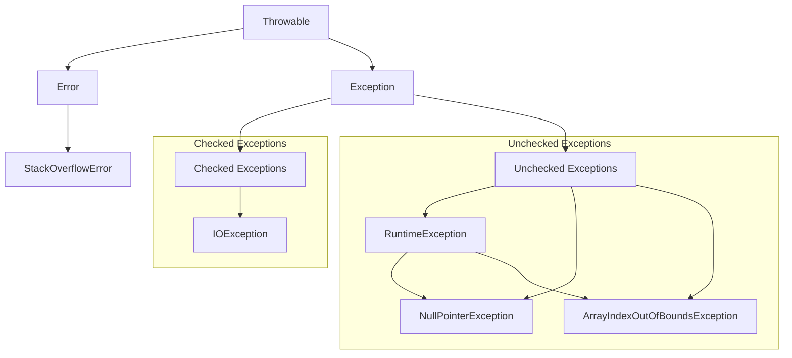

# Java Exceptions
*Table of Contents:*
- [[#🎯 What & Why|🎯 What & Why]]
- [[#⚡ Core Syntax|⚡ Core Syntax]]
- [[#🔧 Essential Methods|🔧 Essential Methods]]


---

## 🎯 What & Why
**Purpose**
	Exception handling in Java is a mechanism for managing runtime errors to maintain the normal flow of an application. An exception is an unexpected event that can disrupt a program's execution. By handling exceptions, you can anticipate specific errors and gracefully recover from them, preventing the program from crashing. This approach separates error-handling code from the main program logic, making the code cleaner and more readable.

**Use When:** 
- **Input Validation:** Exceptions are often used to handle invalid data from users, such as a non-numeric string where a number is expected. 
- **Resource Management:** They are essential for managing external resources like files or database connections, ensuring resources are properly closed even if an error occurs.
- **Network Communication:** Exception handling is crucial for applications that communicate over a network, as connections can fail or data can be corrupted.


---

## ⚡ Core Syntax
Different Approaches to handle Exception in Java:
- try ... Catch Block
- Finally block
- Throw and Throws keyword


**Try...Catch Block**
```java
try {

} catch(Exception e) {

}
```
When an Exception occurs, it is caught by the catch block. The catch block cannot be used first without the try block.
- Can use Multiple catch blocks to handle different exceptions depending on the use case

> The `try` block contains the code that might throw an exception, while the `catch` block handles the exception if it occurs.

*Example Code*
```java
class Main {
  public static void main(String[] args) {

    try {

      // code that generate exception
      int divideByZero = 5 / 0;
      System.out.println("Rest of code in try block");
    }
    
    catch (ArithmeticException e) {
      System.out.println("ArithmeticException => " + e.getMessage());
    }
  }
}
// Output: ArithmeticException => / by zero
```
Error Happened because the program tried to divide a number by 0.
- `.getMessage()` - Prints out the error message into the console


**Finally Block**: (OPTIONAL) - Always executed no matter weather there is an exception or not. Works with the `try...catch` block.
```java
try {

} catch(ExceptionType1 e1) {

} finally {

}
```
The `finally` block is optional and contains code that is always executed, regardless of whether an exception was thrown or caught. It is commonly used for cleanup tasks like closing resources.

*Example Code:*
```java
class Main {
  public static void main(String[] args) {
    try {
      // code that generates exception
      int divideByZero = 5 / 0;
    }

    catch (ArithmeticException e) {
      System.out.println("ArithmeticException => " + e.getMessage());
    }
    
    finally {
      System.out.println("This is the finally block");
    }
  }
}
```
1. Error: Tried to divide number by 0
2. Finally: Prints out optional message to the console.


**Throw and Throws Keyword**
- The `throw` keyword is used to explicitly throw a single exception from a method.
	- Used to declare the type of exceptions that might occur within the method. It is called a **Method Declaration**.
```java
class Main {
  public static void divideByZero() {

    // throw an exception
    throw new ArithmeticException("Trying to divide by 0");
  }

  public static void main(String[] args) {
    divideByZero();
  }
}
/* 
Exception in thread "main" java.lang.ArithmeticException: Trying to divide by 0
        at Main.divideByZero(Main.java:5)
        at Main.main(Main.java:9)
*/
```

- The `throws` keyword is used in a method signature to declare which checked exceptions the method might throw. This forces the calling method to either handle the exception or re-declare it with `throws`.'
```java
import java.io.*;

class Main {
  // declareing the type of exception
  public static void findFile() throws IOException {

    // code that may generate IOException
    File newFile = new File("test.txt");
    FileInputStream stream = new FileInputStream(newFile);
  }

  public static void main(String[] args) {
    try {
      findFile();
    }
    catch (IOException e) {
      System.out.println(e);
    }
  }
}
// Output: java.io.FileNotFoundException: test.txt (The system cannot find the file specified)
```
1. If the file does not exist, `FileInputStream` throws a `FileNotFoundException` which extends the `IOException` class.
2. `findFile()` - Method that allows the `FileFoundException` to be thrown

---
## 🔧 Essential Methods
**Checked vs. Unchecked Exceptions**
- **Checked Exceptions:** These are exceptions that the compiler checks at compile time. They must be handled either by a `try-catch` block or by being declared in the method signature with the `throws` keyword. Examples include `IOException` and `SQLException`.
    
- **Unchecked Exceptions:** These exceptions are not checked at compile time and occur at runtime. The compiler does not require you to handle them. They typically represent programming errors. Examples include `NullPointerException` and `ArrayIndexOutOfBoundsException`.
    
- **Errors:** These are subclasses of `Throwable` but not `Exception`. They represent serious problems that applications should not try to catch, such as `StackOverflowError`.
    

**Custom Exceptions** You can create your own custom exceptions to provide meaningful, domain-specific information about an error. This can improve code readability and error tracking.
```java
// Example of a custom checked exception
public class InsufficientFundsException extends Exception {
    public InsufficientFundsException(String message) {
        super(message);
    }
}

public class BankAccount {
    private double balance;

    public BankAccount(double initialBalance) {
        this.balance = initialBalance;
    }

    public void withdraw(double amount) throws InsufficientFundsException {
        if (balance < amount) {
            throw new InsufficientFundsException("Cannot withdraw " + amount + ". Insufficient funds.");
        }
        balance -= amount;
        System.out.println("Withdrawal successful. New balance: " + balance);
    }

    public static void main(String[] args) {
        BankAccount account = new BankAccount(500);
        try {
            account.withdraw(600);
        } catch (InsufficientFundsException e) {
            System.err.println("Transaction failed: " + e.getMessage());
        }
    }
}

// Output
// Transaction failed: Cannot withdraw 600.0. Insufficient funds.
```

---
# Diagram Representation
**Exception Hierarchy** The Java exception hierarchy shows the relationship between classes, with all exceptions and errors inheriting from the `Throwable` class.



---
## ⚖️ Quick Pros/Cons
*Advantages:*
- **Separation of Concerns:** Exception handling allows you to separate error-handling code from the main business logic, making the code easier to read and maintain.
    
- **Error Reporting:** Exceptions provide meaningful information about what went wrong, including the type of error, a message, and the program state at the time of the error.
    
- **Robustness:** Proper exception handling makes applications more robust and reliable by providing a clear mechanism to gracefully handle unexpected situations.
    
*Disadvantages:*
- **Performance Overhead:** Creating and throwing an exception is a relatively expensive operation, especially due to the cost of generating the stack trace. Using exceptions for normal program flow control (e.g., using a `try-catch` block inside a loop) is an anti-pattern and can lead to significant performance degradation.
    
- **Code Clutter:** Overusing `try-catch` blocks can clutter the code and reduce readability. The "throw early, catch late" principle suggests catching exceptions only at the level where they can be meaningfully handled.

---

## 🐛 Common Issues
- **`NullPointerException`:** Occurs when you try to use an object reference that has not been initialized.
    
    - **Solution:** Check for `null` before accessing the object, use `Optional<T>`, or use a guard clause to fail early.
        
- **`NumberFormatException`:** Thrown when attempting to convert a string to a numeric type, but the string's format is incorrect.
    
    - **Solution:** Validate user input with regular expressions or other methods before attempting to parse it.
        
- **`ArrayIndexOutOfBoundsException`:** Thrown when you try to access an array element with an invalid index.
    
    - **Solution:** Always check array bounds before accessing an element or use a `for-each` loop to iterate over the array.


---

## 💡 Key Tips
- **Be Specific:** Always catch the most specific exception possible instead of a generic `Exception` or `Throwable`. This provides better error recovery and prevents you from accidentally catching serious errors.
    
- **Log Thoroughly:** When you catch an exception, log it with a clear message and the full stack trace to aid in debugging.
    
- **"Throw Early, Catch Late":** The principle is to throw an exception as soon as an error is detected and catch it at a higher level where you have enough information to handle it properly.
    
- **Use `try-with-resources`:** For resources that must be closed (like file streams or database connections), use a `try-with-resources` statement to ensure they are automatically closed, preventing resource leaks. This is a best practice introduced in Java 7.
    
- **Avoid Empty `catch` Blocks:** Do not "swallow" exceptions by catching them and doing nothing. This makes debugging extremely difficult.


> [!NOTE] ☁️ Programmer Thought 
> We Can go more in depth into how the different types of exception handling works but that would be unnecessary. As you write more and more programs, you will slowly learn how to manage exceptions like a pro


---
# Back Matter

**Source**
<!-- Always keep a link to the source- --> 
- based_on:: Programmiz - Error Handling

```cardlink
url: https://www.programiz.com/java-programming/exception-handling
title: "Java Exception Handling (With Examples)"
description: "We can use the try...catch block, finally block, throw, and throws keyword to handle exceptions in Java. In this tutorial, we will learn about Java exception handling with the help of examples."
host: www.programiz.com
```


**References**
<!-- Links to pages not referenced in the content. see: [[related note]] because <reason> -->
- see:: [[J11 - Exception Handling]]

**Terms**
<!-- Links to definition pages. -->
- `try...catch` block
- `try...catch...finally` block
- `Throws & Throw` block
---
**Tasks**
<!-- What remains to be done with this note? --> 
- Try Doing some practice problems with this topic. Do not use AI to help you solve it. Try to solve it first for the first ten minutes. Use the documentation here or search deeper to grasp the concept better. Use AI only when you have tried at least 5 times.

**Questions**
<!-- What remains for you to consider? --> 
- question::How do I use the Try...Catch Resource management block?
- question::How do I implement this into a bigger code base?
- question::What did I learn today and How can I Improve it?

---
**Template Help**
<!-- Links to external help pages on GitHub. -->
- [Basic Template Structure](https://github.com/groepl/Obsidian-Templates#basic-template-structure)
- [How to Use Links](https://github.com/groepl/Obsidian-Templates#how-to-use-links)
- [How to Use Tags](https://github.com/groepl/Obsidian-Templates#how-to-use-tags)
- [How to Search Notes](https://github.com/groepl/Obsidian-Templates#how-to-search-notes)
- [Plugins Needed](https://github.com/groepl/Obsidian-Templates#obsidian-plugins-needed)
- [Find Latest Updates](https://github.com/groepl/Obsidian-Templates)


