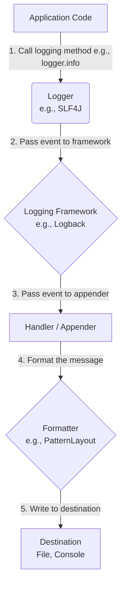

<!--  See "Template Help" below for using properties -->

# Java Logging
*Table of Contents:*
- [[#Comprehensive Documentation for Java Logging|Comprehensive Documentation for Java Logging]]
	- [[#Comprehensive Documentation for Java Logging#1\. Overview|1\. Overview]]
	- [[#Comprehensive Documentation for Java Logging#2\. Syntax|2\. Syntax]]
	- [[#Comprehensive Documentation for Java Logging#3\. Methods & Frameworks|3\. Methods & Frameworks]]
	- [[#Comprehensive Documentation for Java Logging#4\. Pros and Cons|4\. Pros and Cons]]
	- [[#Comprehensive Documentation for Java Logging#5\. Common Issues and Solutions|5\. Common Issues and Solutions]]
	- [[#Comprehensive Documentation for Java Logging#6\. Tips and Best Practices|6\. Tips and Best Practices]]
	- [[#Comprehensive Documentation for Java Logging#7\. Diagrams|7\. Diagrams]]
	- [[#Comprehensive Documentation for Java Logging#9\. Practice Problems|9\. Practice Problems]]
	- [[#Comprehensive Documentation for Java Logging#10\. Quick Reference|10\. Quick Reference]]


---
### Comprehensive Documentation for Java Logging

#### 1\. Overview

**1.1 What & Why**
Logging is the practice of recording events during a program's execution to create an audit trail for later analysis. It is a critical component for monitoring application behavior, diagnosing issues, and debugging problems, especially in production environments where direct debugging is not possible. Logs can help developers track down exceptions, monitor performance, and pinpoint bottlenecks.

**1.2 Purpose and Use Cases**
Logs are used for:

  * **Debugging:** Identifying and fixing errors.
  * **Monitoring:** Tracking application health and performance over time.
  * **Auditing:** Creating a record of significant events, such as user logins or financial transactions.
  * **Troubleshooting:** Analyzing why an application failed or behaved unexpectedly.

**1.3 Key Concepts and Analogies**
  * **Logger:** The component that captures log events. Think of it as a reporter who writes down everything that happens.
```java
Logger logger = logger.getLogger("<String Argument>")
```
1. `getLogger()` - Used to find or create a new logger
2. `<String Argument>` - Defines the name of the logger

  * **Handler / Appender:** The component that dictates where log entries are sent. This is like a publisher deciding whether the story goes to a newspaper, a website, or a database.
1. `addHandler(handler);` - To add a new Handler
2. `Handler handler = new ConsoleHandler();` - Create a new object from the interface Handler.
3. `removeHandler(handler);` - Removes a handler
4. `Handler[] handlers = logger.getHandlers();` - Gets all available Handlers


  * **Level:** The severity of a log event (e.g., `INFO`, `ERROR`). This is the headline's intensity, indicating how important the story is.

*To set a different level of logging:*
```java
logger.setLevel(Level.logLevel);
// With Message
logger.log(Level.LogLevel, "Log Message")
// OR
logger.log(Level.INFO, "This is an info Log Message");

// EXAMPLE
logger.setLevel(Level.FINE);
```

| Log Level (DSC Order) | Use                                                   |
| --------------------- | ----------------------------------------------------- |
| `SEVERE`              | serious Failure                                       |
| `WARNING`             | Warning Message, Potential Problem                    |
| `INFO`                | General Runtime Info                                  |
| `CONFIG`              | Configuration Information                             |
| `FINE`                | General Dev Information (Tracing Messages)            |
| `FINER`               | Detailed Dev Information (Tracing Messages)           |
| `FINEST`              | Highly Detailed Dev Information (Tracing Message)     |
| `OFF`                 | Turn Off Logging for all levels (Captures nothing)    |
| `ALL`                 | Turn on Logging for all levels (Captures Everything.) |

  * **Formatter / Layout:** The component that defines the format of the log entry. This is the editor who arranges the story with a title, date, and body content.
1. `SimpleFormatter` - Formats Log Record to String
2. `XMLFormatter` - Formats Log Record to XML Form

```java
// Formats to string
handler.setFormatter(new SimpleFormatter());
// Formats to XML form
handler.setFormatter(new XMLFormatter());
```

*To keep track of all your global logs*:
	Use the `LogManager` object which reads and maintains log configuration and logger instances. Only one instance can be initiated
	`LogManager manager = new LogManager();`


The standard Java library provides `java.util.logging` (JUL), but third-party frameworks like Log4j2 and Logback are more commonly used for their advanced features, performance, and flexibility. To avoid being tied to a single framework, many developers use a logging facade like **SLF4J (Simple Logging Facade for Java)**, which provides a single API that can be used with any compatible logging implementation.

#### 2\. Syntax

Here is a basic example using the built-in `java.util.logging` framework.

```java
import java.util.logging.Logger;
import java.util.logging.Level;

public class BasicLoggingExample {
    // Get a logger for the current class.
    private static final Logger LOGGER = Logger.getLogger(BasicLoggingExample.class.getName());

    public static void main(String[] args) {
        // Log messages at different levels
        LOGGER.info("This is an informational message.");
        LOGGER.warning("This is a warning. Something unusual happened.");
        
        try {
            // Simulate an error
            int result = 10 / 0;
        } catch (ArithmeticException e) {
            // Log the exception
            LOGGER.log(Level.SEVERE, "An error occurred during a division operation.", e);
        }
    }
}
```

**Using SLF4J with Logback (Recommended)**
This approach decouples your code from the specific logging implementation, making it more flexible.

```java
import org.slf4j.Logger;
import org.slf4j.LoggerFactory;

public class SLF4JExample {
    // Use the SLF4J LoggerFactory to get a logger.
    private static final Logger logger = LoggerFactory.getLogger(SLF4JExample.class);

    public static void main(String[] args) {
        logger.info("Application starting up.");
        
        String user = "admin";
        int failedAttempts = 3;

        // Use parameterized messages to avoid expensive string concatenation
        logger.warn("User {} made {} failed login attempts", user, failedAttempts);
        
        try {
            throw new IllegalArgumentException("Invalid input data.");
        } catch (Exception e) {
            // Log the exception with the full stack trace
            logger.error("An unexpected error occurred", e);
        }
    }
}
```

#### 3\. Methods & Frameworks

Modern Java logging relies on a tiered system, typically using a facade (like SLF4J) with a robust logging framework (like Log4j2 or Logback).

**3.1 Common Logging Frameworks**
  * **`java.util.logging` (JUL):** The default, built-in framework. Simple to use for small projects but lacks the advanced features and performance of modern alternatives.
  * **Log4j2:** A powerful and flexible framework with improved performance, especially due to its asynchronous logging capabilities. It supports multiple configuration file formats (XML, JSON, YAML) and offers features like automatic configuration reloading.
  * **Logback:** Developed by the creator of the original Log4j, Logback is a high-performance successor with a modular design and native support for SLF4J. It also features automatic configuration reloading and advanced rolling file appenders.

**3.2 The Logging Facade: SLF4J**
SLF4J is a facade, not a logging framework itself. It provides a simple API that acts as a bridge to other logging frameworks. This allows you to write your code once using the SLF4J API and then choose the underlying logging implementation (e.g., Logback, Log4j2) at deployment time without changing your code. This flexibility is why SLF4J is considered a best practice for modern Java applications.

#### 4\. Pros and Cons

| Framework/API | Advantages | Disadvantages |
| :--- | :--- | :--- |
| **`java.util.logging` (JUL)** | Part of the JDK, no external dependencies. Easy for basic logging needs. | Limited features and flexibility. Less performant than modern frameworks. |
| **Logback** | High performance and reliability. Native support for SLF4J. Automatic configuration reloading. | Requires an extra dependency for the SLF4J API. Configuration can be more complex than JUL. |
| **Log4j2** | Excellent performance, especially with asynchronous logging. Garbage-free logging option to reduce GC overhead. Flexible configuration with multiple formats (XML, JSON, YAML). | Larger footprint compared to other frameworks. Requires learning new configuration syntax. |
| **SLF4J** | Decouples logging API from implementation. Allows switching logging frameworks without code changes. Lightweight and widely supported. | Not a logging framework itself; requires a separate implementation like Logback or Log4j2. |

#### 5\. Common Issues and Solutions
  * **Performance Impact:** Frequent logging, especially with string concatenation (`"User " + user + " logged in"`), can significantly impact performance.
      * **Solution:** Use parameterized logging (`logger.info("User {} logged in", user)`). The expensive string creation only happens if the log level is enabled. For high-performance systems, use asynchronous loggers to offload logging to a background thread.
  * **Unreadable Logs:** Poorly formatted logs make debugging difficult.
      * **Solution:** Use a consistent, structured format like JSON. This makes logs easier to parse and analyze with log management tools.
  * **File Permissions:** The application may not have permission to write to the specified log file location, leading to errors.
      * **Solution:** Ensure the log file path is accessible by the user running the Java application. Use relative paths or environment variables to specify log locations.
  * **Logging Sensitive Data:** Accidentally logging passwords, credit card numbers, or other Personally Identifiable Information (PII) can create serious security and compliance risks.
      * **Solution:** Never log sensitive data in plain text. Use masking, tokenization, or simply avoid logging the data altogether.
  * **Inappropriate Log Levels:** Using too many or too few logs can be problematic. Logging at `DEBUG` or `TRACE` in production can flood the system with unnecessary data, while logging too little can make troubleshooting impossible.
      * **Solution:** Use log levels consistently. Set appropriate levels for different environments (e.g., `INFO` or `WARN` for production, `DEBUG` for development).

#### 6\. Tips and Best Practices
  * **Use a Facade like SLF4J:** This provides flexibility and future-proofs your application.
  * **Choose a Robust Framework:** For most projects, Logback or Log4j2 are excellent choices due to their performance and features.
  * **Use Proper Log Levels:** Be intentional about the level you use.
      * `FATAL` / `SEVERE`: Unrecoverable errors that will crash the application.
      * `ERROR`: An error occurred, but the application may be able to continue.
      * `WARN`: An unexpected situation that should be investigated, but not an error.
      * `INFO`: Normal, expected events that are useful for tracking application flow.
      * `DEBUG`: Detailed information for developers to use during troubleshooting.
      * `TRACE` / `FINEST`: Extremely detailed information for deep debugging.
  * **Log Meaningful Messages:** Provide context and all relevant details. Instead of "Error occurred," use "Failed to connect to database".
  * **Include Stack Traces for Exceptions:** Always log the full stack trace when catching an exception to get all the necessary information for debugging.
  * **Use Structured Logging:** Log in a structured format like JSON to make it easier for log aggregators and analysis tools to process the data.
  * **Consider Asynchronous Logging:** For high-throughput applications, use asynchronous logging to minimize the performance impact on the main application thread.

#### 7\. Diagrams

A simple ASCII diagram to illustrate the flow of a log message:


  * **Explanation:** The application code initiates a log event. The Logger captures this event and, if its level is appropriate, passes it to the underlying logging framework. The framework's Handler/Appender then uses a Formatter to arrange the log message and sends it to a final destination like a file or the console.

#### 9\. Practice Problems

**Basic**
1.  **Console Logger:** Write a simple Java program using `java.util.logging` to print "Hello, world\!" to the console at the `INFO` level.
2.  **Multiple Levels:** Create a class that logs messages at `INFO`, `WARNING`, and `SEVERE` levels to demonstrate the different severities.
3.  **File Appender:** Configure a `java.util.logging` FileHandler to write all logs from a specific class to a file named `app.log`.

**Intermediate**
1.  **SLF4J and Logback:** Set up a project with SLF4J and Logback. Configure Logback to write logs to both the console and a `debug.log` file. The console should only show `INFO` and higher levels, while the file should capture everything from `DEBUG` up.
2.  **Parameterized Logging:** Rewrite the code from the previous problem to log a message with a variable, for example, "User 'john\_doe' logged in successfully." Use parameterized logging to avoid string concatenation.
3.  **Logging Exceptions:** In a class, create a method that throws an `IllegalArgumentException`. Call this method from `main` inside a `try-catch` block and use the `error()` method to log the exception, including the full stack trace.

**Advanced**
1.  **Custom Log Configuration:** Using Log4j2, create an XML configuration file that defines two appenders: one for the console with a simple layout and another for a rolling file. The rolling file appender should roll the log file every day and compress old files.
2.  **Mapped Diagnostic Context (MDC):** Implement a logging solution using SLF4J and Logback that automatically adds a unique "requestId" to every log message within a specific thread's execution, even if the logging calls are made from different methods. This is useful for tracing a single request through a multi-threaded application.
3.  **Custom Log Levels and Filters:** Using Log4j2, define a custom log level (e.g., `AUDIT`) and create a configuration that writes all `AUDIT` logs to a separate file, regardless of the root logger's level.

#### 10\. Quick Reference
  * **Logging Facade:** SLF4J
  * **Implementations:** Logback, Log4j2
  * **Log Levels (in order of severity):** `FATAL`/`SEVERE`, `ERROR`, `WARN`, `INFO`, `DEBUG`, `TRACE`/`FINEST`
  * **Core Components:**
      * `Logger`: The object used to log messages.
      * `Appender`/`Handler`: The destination of the logs.
      * `Layout`/`Formatter`: The format of the log message.
  * **Best Practices:**
      * Use a logging facade (SLF4J) to decouple your code.
      * Use parameterized logging to avoid performance overhead.
      * Log meaningful messages with sufficient context.
      * Avoid logging sensitive information.
      * Log full stack traces for exceptions.
      * Use structured logging (e.g., JSON) for easier analysis.
      * Set appropriate log levels for different environments.
      * Consider asynchronous logging for high-performance applications.


> [!NOTE] ☁️ Programmer Thought
> This topic is a bit more complex and I relied heavily in programmiz and geeks for Geeks. The several Logging facades and Implementations were hard to implement within my own personal project so my recommendation is to stick to simple logging for areas you know you want a custom message at.


---
# Back Matter

**Source**
<!-- Always keep a link to the source- --> 
- based_on:: [[J11.1 - Java Exceptions]]

**References**
<!-- Links to pages not referenced in the content. see: [[related note]] because <reason> -->
- see::  Programmiz - Java Logging

```cardlink
url: https://www.programiz.com/java-programming/logging
title: "Java Logging"
description: "In this tutorial, we will learn about Java Logging and its various components with the help of examples. Java allows us to create and capture log messages and files through the process of logging."
host: www.programiz.com
```

- see:: GeeksForGeeks - Java Logging

```cardlink
url: https://www.geeksforgeeks.org/java/logging-in-java/
title: "Logging in Java - GeeksforGeeks"
description: "Your All-in-One Learning Portal: GeeksforGeeks is a comprehensive educational platform that empowers learners across domains-spanning computer science and programming, school education, upskilling, commerce, software tools, competitive exams, and more."
host: www.geeksforgeeks.org
favicon: https://www.geeksforgeeks.org/wp-content/uploads/gfg_200X200-100x100.png
image: https://media.geeksforgeeks.org/wp-content/cdn-uploads/gfg_200x200-min.png
```


**Terms**
<!-- Links to definition pages. -->
- Java logging
- SLF4J, LogBack, Log4J2
- Level
- Formatter
- Handler

---
**Tasks**
<!-- What remains to be done with this note? --> 
- Try the practice problems above starting from the beginner level to advanced before getting in to deep.

**Questions**
<!-- What remains for you to consider? --> 
- question::What is SLF4J at its core? What are its rules?
- question::What is LogBack at its core? What are its rules?
- question::What is Log4J2 at its core? What are its Rules?
  - Question::When do I Implement and and use logging?


