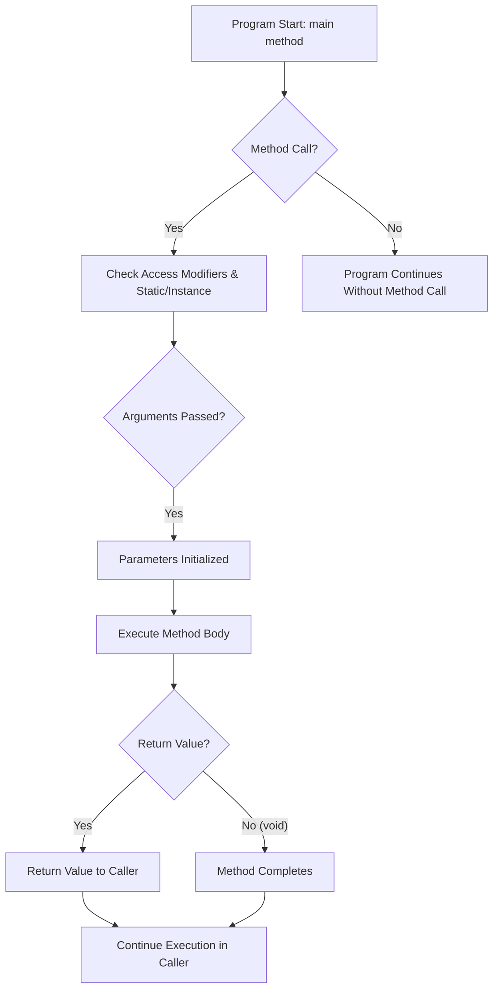

## J6 - Java Methods

—
- [[#**I. Definition, Syntax and Initialization**|**I. Definition, Syntax and Initialization**]]
	- [[#**I. Definition, Syntax and Initialization**#Core Definition|Core Definition]]
	- [[#**I. Definition, Syntax and Initialization**#Basic Syntax|Basic Syntax]]
	- [[#**I. Definition, Syntax and Initialization**#Initialization & Setup|Initialization & Setup]]
	- [[#**I. Definition, Syntax and Initialization**#Fundamental Components|Fundamental Components]]
- [[#**II. Pros, Cons, Use Cases, and Function Methods**|**II. Pros, Cons, Use Cases, and Function Methods**]]
	- [[#**II. Pros, Cons, Use Cases, and Function Methods**#Advantages ✅|Advantages ✅]]
	- [[#**II. Pros, Cons, Use Cases, and Function Methods**#Disadvantages ❌|Disadvantages ❌]]
	- [[#**II. Pros, Cons, Use Cases, and Function Methods**#Primary Use Cases|Primary Use Cases]]
	- [[#**II. Pros, Cons, Use Cases, and Function Methods**#Key Methods & Functions|Key Methods & Functions]]
	- [[#**II. Pros, Cons, Use Cases, and Function Methods**#Best Practices & Tips 💡|Best Practices & Tips 💡]]
- [[#**III. Example Code and Implementation**|**III. Example Code and Implementation**]]
	- [[#**III. Example Code and Implementation**#Complete Working Example|Complete Working Example]]
	- [[#**III. Example Code and Implementation**#Step-by-Step Implementation|Step-by-Step Implementation]]
	- [[#**III. Example Code and Implementation**#Execution Flow Diagram|Execution Flow Diagram]]
	- [[#**III. Example Code and Implementation**#Expected Output|Expected Output]]
	- [[#**III. Example Code and Implementation**#Common Variations|Common Variations]]
- [[#**IV. References and Additional Resources**|**IV. References and Additional Resources**]]
	- [[#**IV. References and Additional Resources**#Documentation Links|Documentation Links]]
	- [[#**IV. References and Additional Resources**#Installation & Setup Commands|Installation & Setup Commands]]
	- [[#**IV. References and Additional Resources**#Further Learning Resources|Further Learning Resources]]
	- [[#**IV. References and Additional Resources**#Related Concepts to Explore|Related Concepts to Explore]]
	- [[#**IV. References and Additional Resources**#Community & Support|Community & Support]]
- [[#**Quick Reference Card**|**Quick Reference Card**]]
	- [[#**Quick Reference Card**#Essential Commands|Essential Commands]]
	- [[#**Quick Reference Card**#Troubleshooting Checklist|Troubleshooting Checklist]]

—


### **I. Definition, Syntax and Initialization**

#### Core Definition
**What is a Java Method?**
	Blocks of code that perform a specific action or task. Used to learn to achieve reusable code, define code once, and use it many times. They help organize code into logical units.


#### Basic Syntax

```java
// Basic syntax structure
accessModifier static returnType methodName(parameter1Type parameter1Name, parameter2Type parameter2Name, ...) {
    // method body
    // statements to be executed
    return returnValue; // Optional, depends on returnType
}
```

#### Initialization & Setup
> [!note] How to get Started:
> - Prerequisites and dependencies
> - Environment setup requirements
> - Basic configuration steps
> - Initial code structure

- **`accessModifier`**: Specifies the visibility of the method. Common modifiers include `public` (accessible from anywhere), `private` (accessible only within the same class), `protected` (accessible within the same package and by subclasses), and default (package-private, accessible only within the same package).
    
- **`static`**: (Optional) If present, the method belongs to the class itself rather than to an instance of the class. It can be called without creating an object of the class.
    
- **`returnType`**: The data type of the value that the method returns. If the method does not return any value, `void` is used.
    
- **`methodName`**: A unique identifier for the method. It should follow Java's naming conventions (e.g., camelCase, starting with a lowercase letter).
    
- **`parameters`**: (Optional) A comma-separated list of input values that the method accepts. Each parameter consists of a `dataType` followed by a `variableName`.
    
- **`method body`**: The block of code enclosed in curly braces `{}` that contains the statements to be executed when the method is called.
    
- **`return returnValue`**: (Optional) A statement that returns a value of `returnType` from the method. It is required for methods with a non-`void` return type.


**Summary**:

| Property             | Details                                                |
| -------------------- | ------------------------------------------------------ |
| **Concept Name**     | Java Method                                            |
| **Category**         | Java                                                   |
| **Primary Purpose**  | Blocks of code that perform a specific action or task. |
| **Complexity Level** | BEGINNER                                               |


---

### **II. Pros, Cons, Use Cases, and Function Methods**

#### ✅ Advantages
> [!note] 
> • **Benefit 1:** Detailed explanation 
> • **Benefit 2:** Detailed explanation 
> • **Benefit 3:** Detailed explanation

- **Code Reusability**: Methods allow you to write a block of code once and use it multiple times, reducing redundancy and making the code base smaller and more manageable.
    
- **Modularity**: They break down a large program into smaller, manageable, and independent modules, improving code organization and readability.
    
- **Easier Debugging**: When code is modularized, it's easier to identify and fix bugs as you can isolate issues to specific methods.
    
- **Improved Maintainability**: Changes or updates can be made within a specific method without affecting other parts of the program, simplifying maintenance.
    
- **Abstraction**: Methods hide the internal implementation details from the user, presenting only the required functionality.


#### ❌ Disadvantages
> [!note] 
• **Limitation 1:** Detailed explanation 
• **Limitation 2:** Detailed explanation 
• **Limitation 3:** Detailed explanation


- **Overhead of Method Calls**: Calling methods involves some overhead (e.g., saving current state, passing arguments, returning control), which can slightly impact performance in highly performance-sensitive applications with frequent, small method calls.
    
- **Complexity with Too Many Parameters**: Methods with a large number of parameters can become difficult to read, understand, and use.
    
- **Tight Coupling (if not designed well)**: Poorly designed methods can lead to tight coupling between different parts of the code, making changes harder.
#### Primary Use Cases
> [!note] 
• **Scenario 1:** When to use this approach 
• **Scenario 2:** Ideal implementation context 
• **Scenario 3:** Problem-solving application

- **Performing specific calculations**: e.g., a method to calculate the area of a circle.
    
- **User input and output**: e.g., a method to read user input or print messages to the console.
    
- **Data manipulation**: e.g., methods to sort an array, search for an element, or modify a string.
    
- **Encapsulating business logic**: e.g., methods within a class that represent specific operations of an object.
    
- **Event handling**: e.g., methods that respond to user interactions in graphical user interfaces.


#### Key Methods & Functions
> [!note] 
• **Method 1:** `methodName()` - Description and parameters 
• **Method 2:** `methodName()` - Description and parameters 
• **Method 3:** `methodName()` - Description and parameters

In Java, "function methods" isn't a standard term; methods are simply functions associated with a class or object. However, certain types of methods or concepts are important:

- **`main` method**: The entry point for any Java application. `public static void main(String[] args)` is the signature for this method.
    
- **Instance Methods**: Methods that operate on an object's instance variables. They must be called on an object.
    
- **Static Methods**: Methods that belong to the class itself, not to an instance. They can be called directly on the class name.
    
- **Constructors**: Special methods used to initialize objects of a class. They have the same name as the class and no return type.
    
- **Getters and Setters**: Conventionally named methods (`getVariableName()`, `setVariableName()`) used to access and modify private instance variables, enforcing encapsulation.


#### 💡 Best Practices & Tips
> [!note] 
• **Tip 1:** Performance optimization advice 
• **Tip 2:** Common pitfall to avoid 
• **Tip 3:** Code organization recommendation

- **Meaningful Names**: Give methods descriptive names that clearly indicate their purpose.
    
- **Single Responsibility Principle**: Each method should ideally have one clear, well-defined purpose.
    
- **Keep Methods Small**: Smaller methods are easier to read, test, and maintain.
    
- **Limit Parameters**: Aim for a reasonable number of parameters. If a method requires many, consider passing an object instead.
    
- **Avoid Side Effects**: Methods should ideally produce the expected output without causing unintended changes to the system state, especially pure functions.
    
- **Add Comments**: Document complex methods or those with non-obvious logic.


---

### **III. Example Code and Implementation**

#### Complete Working Example
```java
// Example 1: A simple method that does not return any value (void)
public class Greeter {
    public void sayHello(String name) {
        System.out.println("Hello, " + name + "!");
    }

    public static void main(String[] args) {
        Greeter greeter = new Greeter(); // Create an object of Greeter class
        greeter.sayHello("Alice"); // Call the sayHello method
    }
}

// Advanced Implementation
// Example 4: Method Overloading (multiple methods with the same name but different parameters)
public class Printer {
    public void print(String message) {
        System.out.println("String: " + message);
    }

    public void print(int number) {
        System.out.println("Integer: " + number);
    }

    public void print(double decimal) {
        System.out.println("Double: " + decimal);
    }

    public static void main(String[] args) {
        Printer printer = new Printer();
        printer.print("Hello Method Overloading!"); // Calls print(String)
        printer.print(123); // Calls print(int)
        printer.print(3.14); // Calls print(double)
    }
}

// Example 5: Methods interacting with instance variables (non-static)
public class Person {
    String name;
    int age;

    // Constructor
    public Person(String name, int age) {
        this.name = name;
        this.age = age;
    }

    // Instance method
    public void introduce() {
        System.out.println("Hi, my name is " + name + " and I am " + age + " years old.");
    }

    // Getter method
    public String getName() {
        return name;
    }

    // Setter method
    public void setAge(int newAge) {
        if (newAge > 0) {
            this.age = newAge;
        } else {
            System.out.println("Age cannot be negative.");
        }
    }

    public static void main(String[] args) {
        Person person1 = new Person("Bob", 30);
        person1.introduce(); // Output: Hi, my name is Bob and I am 30 years old.

        person1.setAge(31);
        System.out.println(person1.getName() + " is now " + person1.age + " years old."); // Output: Bob is now 31 years old.

        person1.setAge(-5); // Output: Age cannot be negative.
    }
}

```

#### Step-by-Step Implementation

- **Define the Class**: Start by defining a Java class where your methods will reside.
    
- **Declare the Method Signature**: Specify the `accessModifier`, `static` (if applicable), `returnType`, `methodName`, and `parameters`.
    
- **Implement the Method Body**: Write the code that performs the desired task inside the curly braces `{}`.
    
- **Handle Return Values**: If the `returnType` is not `void`, ensure your method returns a value of the specified type using the `return` keyword.
    
- **Call the Method**:
    
    - For **static methods**, call them directly using the class name: `ClassName.methodName(arguments);`
        
    - For **instance methods**, create an object of the class first, then call the method on the object: `ClassName objectName = new ClassName(); objectName.methodName(arguments);`
        
- **Test and Verify**: Compile and run your code to ensure the methods work as expected.





- The `main` method is the entry point.
    
- When a method is called, the program flow transfers to that method.
    
- Arguments, if any, are passed and parameters are initialized.
    
- The statements within the method's body are executed.
    
- If the method has a `returnType` other than `void`, a value is returned to the calling location.
    
- After the method completes (either by returning a value or reaching its end for `void` methods), program execution resumes from where the method was called.


---
#### Best Practices Checklist

- ✓ **Use `void` for actions, return types for values.**
    
- ✓ **Design methods to be cohesive and loosely coupled.**
    
- ✓ **Utilize access modifiers (`public`, `private`, `protected`) appropriately to control visibility.**
    
- ✓ **Consider `static` for utility methods that don't depend on object state.**
    
- ✓ **Apply method overloading for different parameter types/counts.**
    
- ✓ **Refactor long methods into smaller, more focused one**


#### Troubleshooting Checklist
- [ ] Check [COMMON_ISSUE_1]
- [ ] Verify [COMMON_ISSUE_2]
- [ ] Ensure [COMMON_ISSUE_3]
- [ ] Test [COMMON_ISSUE_4]


---
## Back Matter

**Source**
<!-- Always keep a link to the source- --> 
- based_on:: Programmiz - Methods

```cardlink
url: https://www.programiz.com/java-programming/methods
title: "Java Methods (With Examples)"
description: "A method is a block of code that performs a specific task. In this tutorial, we will learn to create and use methods in Java with the help of examples."
host: www.programiz.com
```


**References**
<!-- Links to pages not referenced in the content. see: [[related note]] because <reason> -->
- see:: [[JavaCheatSheet.pdf]]


---
**Tasks**
<!-- What remains to be done with this note? --> 
- I had a hard time learning that methods are functions. Java is an OOP Oriented Programming so even the functions are called methods.
- Try the practice problems provided by programmize first and then try to implement them into your project.

**Questions**
<!-- What remains for you to consider? --> 
- question::What is the difference between a function and a method?
- question::How do you properly Declare a method?

---
**Template Help**
<!-- Links to external help pages on GitHub. -->
- [Basic Template Structure](https://github.com/groepl/Obsidian-Templates#basic-template-structure)
- [How to Use Links](https://github.com/groepl/Obsidian-Templates#how-to-use-links)
- [How to Use Tags](https://github.com/groepl/Obsidian-Templates#how-to-use-tags)
- [How to Search Notes](https://github.com/groepl/Obsidian-Templates#how-to-search-notes)
- [Plugins Needed](https://github.com/groepl/Obsidian-Templates#obsidian-plugins-needed)
- [Find Latest Updates](https://github.com/groepl/Obsidian-Templates)


